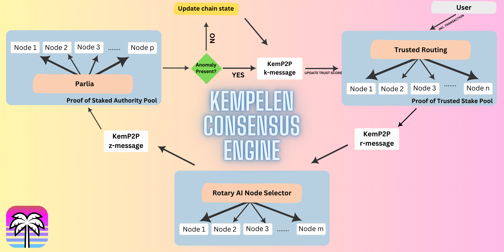

# AI Based Consensus Engine for EVM Blockchain: Kempelen Consensus Engine

*April 2023*  
*Department for Data-Oriented Technologies, Vibe Research LLC.*

## Abstract

The Kempelen Consensus Engine (KCE) is a revolutionary, AI-powered consensus mechanism designed for an Ethereum Virtual Machine (EVM)-powered blockchain. It merges the scalability of Proof-of-Trust (PoT), the security of Proof-of-Authority (PoA), and the innovative potential of community-developed AI models. By combining these powerful features, KCE seeks to create a robust, scalable, and secure blockchain system that grows and adapts with its community, and it includes a unique reward system that fairly distributes gas fees among all contributors.

## Introduction

Blockchain technology has gained significant attention for its potential to revolutionize various sectors, from finance and supply chain to healthcare and education. However, it faces notable challenges, particularly in terms of scalability, energy efficiency, and security. These challenges are primarily due to the limitations of the consensus mechanisms predominantly used today: Proof of Work (PoW) and Proof of Stake (PoS).

Proof of Work (PoW), while secure, involves high energy consumption, limited scalability, and risks of centralization. Proof of Stake (PoS), more energy-efficient than PoW, presents challenges including potential wealth concentration, lack of adequate punishment for malicious validators, and susceptibility to long-range attacks.

Given these challenges, KCE leverages the scalability of Proof-of-Trust (PoT), the security of Proof-of-Authority (PoA), and the innovative potential of community-developed AI models. PoT, an evolution of PoS, improves upon its limitations by distributing validation rights among trusted nodes based on their contribution and behavior, leading to enhanced decentralization and reduced central authority control.

## Kempelen Consensus Engine Overview

KCE introduces a unique tri-node structure: AI Node Pool, PoT Validator Pool, and PoA Validator Pool.

### AI Node Pool

AI nodes are responsible for scanning and validating transactions processed by the PoT validators. These nodes leverage machine learning models, primarily the One-Class SVM anomaly detection mechanism, to identify any potential malicious activity. The One-Class SVM model fits a tight hypersphere around normal data, and any data point that lies outside this boundary is considered an outlier. Mathematically, this can be represented as:

min ||ϕ(x_i) - a||^2 ≤ R^2 + ξ_i, ξ_i ≥ 0

Where R is the radius of the hypersphere, ϕ(x_i) represents the data points mapped in the feature space, and a is the center of the hypersphere.

The trustworthiness of each PoT validator's transactions is then assigned a trust score.

### PoT Validator Pool

The PoT validators are responsible for the scalability and growth of the network. They process and validate transaction blocks. Their performance and trustworthiness are evaluated by the AI nodes.

### PoA Validator Pool

PoA validators provide additional security to the network. They adjust the trust score of PoT validators based on the results from the AI node pool.

This tri-node structure ensures a scalable, secure, and efficient blockchain ecosystem. In KCE, gas fees are distributed as rewards among all contributors, encouraging active participation from the community.

## Improved Anomaly Detection and Dynamic Trust Score Adjustment

Building upon the Kempelen Consensus Engine's core architecture, the system integrates advanced machine learning models to detect anomalous transactions. This AI-powered system utilizes an ensemble approach, specifically Bagging, with the One-class SVM model. By creating subsets of the original data, training a separate classifier on each subset, and subsequently combining their output, the KCE boasts improved anomaly detection robustness and a reduction in overfitting. This continuous learning and evolving system presents an even more accurate and resilient platform for users and stakeholders.

Assuming a dataset D of size n. Bagging works as follows:

- Generate m new training sets D_i, each of size n', by sampling from D uniformly and with replacement. This process is also known as bootstrap.
- Train a new classifier C_i on each D_i.
- Combine the classifiers C_i by averaging their output (for regression) or voting for the majority class (for classification).

Simultaneously, our KCE takes the trust score adjustment a step further. Instead of static trust scores, we introduce dynamic trust scores that are adjusted according to transaction history, frequency, and other behavioral patterns. The AI node pool effectively computes these trust scores using a time-decaying function, enabling an adaptive and efficient consensus system. This function works as follows:

T'_i = T_i × d^(t - t_i)

Moreover, KCE implements a unique Proof of Trust (PoT) consensus mechanism. This mechanism assigns each validator a trust score, determining their likelihood of adding a block to the blockchain. New validators start with a default trust score - for example, 0.5 on a range of [0, 1] - and this score is dynamically updated based on their behavior. The formula for trust score adjustment is:

T' = T + α × (V/O) - β × (I/O)

Through this strategy, validators are incentivized to propose valid blocks and avoid proposing invalid blocks. Consequently, our network fosters a more reliable, secure, and efficient system that is both fair and inclusive.

These enhanced features of the Kempelen Consensus Engine not only bolster the security and reliability of our system but also make it more user-centric and inclusive. We believe these improvements will greatly appeal to our users and prospective participants, further strengthening the KCE's position as a leader in AI-integrated blockchain technology.

*Remember, this information should be interpreted in the context of a working and tested system. While the theoretical principles and mathematical formulas described here form the core of the Kempelen Consensus Engine's design, the actual implementation of these concepts is a sophisticated process that involves complex software engineering and careful testing. As such, the Kempelen Consensus Engine is an ongoing project that continually seeks to adapt and incorporate new advances in AI and blockchain technology.*

## Network and System Design

The KCE architecture incorporates the innovative and synergistic potential of a tri-node structure, namely, the AI Node Pool, PoT Validator Pool, and the PoA Validator Pool. Each of these components plays a crucial role in maintaining and enhancing the overall integrity, efficiency, and adaptability of the system.

### AI Node Pool

The AI nodes, functioning as the backbone of the KCE, continuously scan and validate transactions processed by the PoT validators. AI node operators are empowered to leverage various machine learning models and libraries, encouraging innovative problem-solving and model optimization.

### PoT Validator Pool

Validators under the PoT framework contribute to the network's scalability and growth. The trust score assigned to each validator reflects their overall performance and reliability, which in turn influences the transaction validation frequency. This dynamic system promotes an active, efficient, and transparent network.

### PoS Validator Pool

PoA validators act as an additional security layer for the network, adjusting the trust score of PoT validators based on evaluations from the AI Node Pool. This symbiotic relationship strengthens the network's resistance to malicious activities and increases overall trustworthiness.

The KCE network is continuously optimized to leverage the full potential of community-developed AI models, improve trustworthiness evaluations, and increase the efficiency of the PoA Validator Pool. This iterative and user-centric design approach ensures the sustainable growth and resilience of the KCE ecosystem.

## Conclusion

The Kempelen Consensus Engine provides an innovative solution to the long-standing challenges in traditional blockchain consensus mechanisms. By merging the capabilities of AI with the PoT and PoA consensus methods, KCE provides a blockchain system that is scalable, secure, and energy-efficient. This innovative approach paves the way for a more inclusive and efficient blockchain community, where all contributors share in the network's rewards. KCE is thus a promising model for future blockchain consensus mechanisms, offering a more sustainable, inclusive, and innovative pathway.
